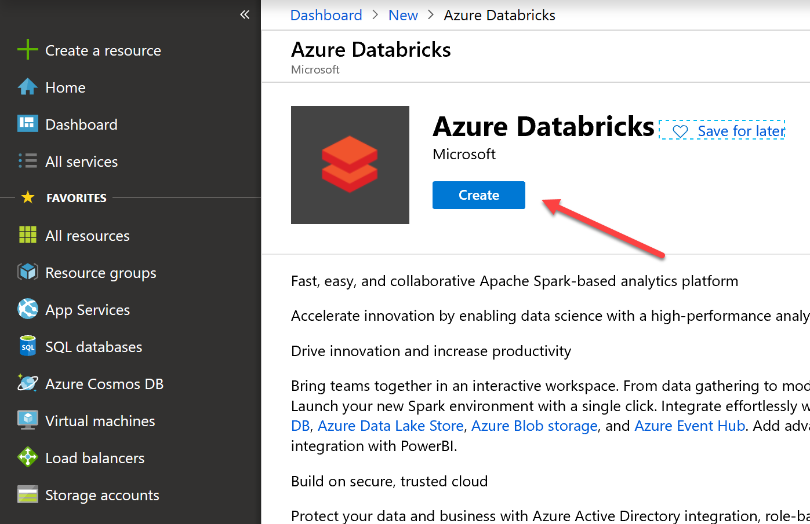

# Hands-on with Databricks

## Setup and basics

### Create an Azure Databricks workspace

To use Azure Databricks, the first thing to do is to create a workspace. The Workspace is the special root folder for all of your organization&#39;s Azure Databricks assets. The Workspace stores all your notebooks, libraries, and dashboards. By default, the Workspace and all its contents are available to users, but each user also has a private home folder that is not shared. You can control who can view, edit, and run objects in the Workspace by enabling Workspace access control.

Do the following to create your first workspace:

1. Open the azure Portal: portal.azure.com
1. Click Create a resource in the left column

 	

1. Write &quot;databricks&quot; in the search box and select Azure Databricks

	

1. In the end of the information page that shows up, click Create:

	

1. Fill in the basic data in the mini-form. Pick your own unique names and hit Create.

	

1. Deployment of the Workspace should take about 2 minutes. When it&#39;s over, head over to the Workspace, for example by clicking &quot;Go to resource&quot; in the notification:

	

1. To access your Databricks Workspace, now click &quot;Launch Workspace&quot;:

	

1. Another browser window will open, and you&#39;ll be automatically signed in to the cluster.

## Create an Azure Databricks cluster

The workspace by itself allows you to store your artefacts but doesn&#39;t include the any servers on which to run Spark. To do this you must create a cluster. To do this:

1. Access the Clusters option:

	

1. Click Create Cluster:
 
	

1. Fill in the form as in the following screenshot:
 
	

> Note: please pay attention to important fields which have different values than the defaults: Databricks Runtime Version, Python Version, Max Workers.**
Also note that by default your cluster will be stopped after 120 minutes of inactivity, which avoids ramping up Databricks costs even if you forget to turn it off.

> Creating a cluster like this takes 5 minutes. You&#39;re now ready to create your first notebook.

## Create your first Databricks notebook

Databricks Notebooks are similar to Jupyter notebooks, but focused on offering a front-end to the Spark engine, which no longer needs to be programmed from the command line, and supporting multiple languages like R, Scala, Python or SQL.

To create a notebook:

1. Click Workspace, then Users, then the little gray arrow next to your username, then Create \&gt; Notebook:
 
	

1. Pick the name and default language and click Create

	

1. The notebook is ready for use:

	

> Note: by default, any code you write in this notebook will be executed as Python. If you want to use other contents you can use the magic commands, by putting them right at the top of the cells, as shown in the following image. For this challenge the relevant magic commands are:

- **%py** - cell is in python language. As this is the default language of the Notebook we created, it can be omitted
- **%md** - cell is in markdown, a simplified HTML-like language used to write documentation (as in GitHub)
- **%sh**  - cell includes Linux shell commands that execute directly in the underlying VM
- **%sql** - cell includes SQL commands.

If it&#39;s your first time using Databricks Notebooks, reading [https://docs.databricks.com/user-guide/notebooks/notebook-use.html](https://docs.databricks.com/user-guide/notebooks/notebook-use.html) is highly recommended. Also note that Databricks Notebooks and Jupyter Notebooks are not exactly the same.

One additional note is that Databricks clusters come pre-installed with many popular libraries. In the case of Python, the list includes packages such as Pandas, numpy, scikit-learn matplotlib and ggplot. Full list here: [https://docs.databricks.com/release-notes/runtime/5.0.html#installed-python-libraries](https://docs.databricks.com/release-notes/runtime/5.0.html#installed-python-libraries)

Finally, another relevant note is that Databricks Notebooks can be scheduled for regular execution, using the &quot;Jobs&quot; option in the left menu bar of the workspace.

1. Import an existing notebook or collection of notebooks

1. To import an existing notebook or collection of notebooks, do similar steps to the previous, but select Import instead of Create:
 
	

1. And in the following screen:
 
	

> The .dbc format is a Databricks archive, a package that can contain a folder of notebooks or a single notebook. A Databricks archive is a JAR file with extra metadata and has the extension &quot;dbc&quot;.

> For this course, download a DBC file [Databricks Fundamentals.dbc] (<https://github.com/TheovanKraay/databricks-lab/blob/master/Databricks%20Fundamentals.dbc>). from this repo **and install it in your cluster.**
